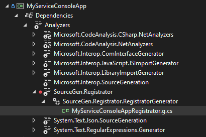

# SourceGen.Registrator
 An advanced dependency service registration logic with Source Generators. Tens of times faster than reflection registrations.

 ## Features
 - **Source Generators**.
     -  _Easy to debug. No runtime reflection errors._
 - **AOT** compatible:
     - _Everything is written in your project and compiled with your assembly according to your target architecture._
 - ...

## Usage

1. Mark services with attributes to notify source generator.
```cs
[RegisterAsTransient]
class MyService
{
}
```

2. The file will be generated in the same assembly with the name `{YourAssemblyName}Registrator.g.cs` in your root namespace. You can see the generated code by enabling the `Show All Files` option in the Solution Explorer.

    

    ```cs
    using Microsoft.Extensions.DependencyInjection;

    namespace MyServiceConsoleApp;
    public static class MyServiceConsoleAppRegistrator
    {
        public static IServiceCollection RegisterMyServiceConsoleAppServices(this IServiceCollection services)
        {
            services.AddTransient<MyService>();
            return services;
        }
    }
    ```

1.  The source generator will generate an extension method for IServiceCollection. Method name will be `Register{YourAssemblyName}Services()`. Use it on your ServiceCollection instance.

    ```cs
    services.RegisterMyProjectServices();
    ```

### Flexible Customization
Registrator provides flexible registration options unlike alternatives, you can use multiple service types or lifetime by combining attributes:

```cs
[RegisterAsTransient(typeof(IServiceA), typeof(IServiceB))]
[RegisterAsScoped(typeof(IServiceC))]
class MyServiceA : IServiceA, IServiceB, IServiceC
{
}
```

- And the generated code will be:

    ```csharp
    using Microsoft.Extensions.DependencyInjection;

    namespace MyServiceConsoleApp;
    public static class MyServiceConsoleAppRegistrator
    {
        public static IServiceCollection RegisterMyServiceConsoleAppServices(this IServiceCollection services)
        {
            services.AddScoped<IServiceC, MyServiceA>();
            services.AddTransient<IServiceA, MyServiceA>();
            services.AddTransient<IServiceB, MyServiceA>();
            return services;
        }
    }
    ```

## Work in progress
This is a simple PoC of source generator service registration and **work in progress**. The project is not ready to use for production yet...
